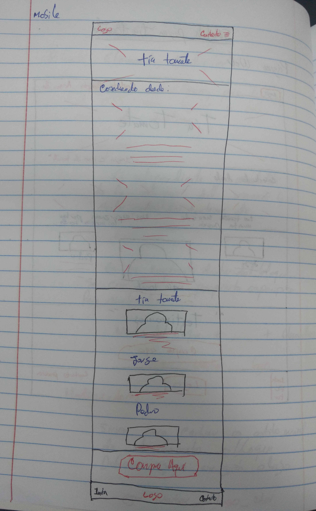

# Pre-Maquetación de la Página de tía tomate

## Requerimientos del cliente:

1. La página debe ser responsive
2. Debe mostrar el amor que siente por sus tomates
3. Dar enfasis a la compra de sus productos
4. Mostrar el logo de la empresa

## El usuario requerirá:

1. Poder ver el contenido de la página en una variedad de dispositivos
2. Una forma de contactarse con la compañía de tía tomate
3. Una forma de comprar online los productos ofrecidos 
4. Información sobre la tía tomate y su negocio
5. Testimonios sobre la calidad de los productos
6. Informacion sobre premios obtenidos de haber alguno
7. Fotos de los productos y el negocio

## La interfaz del usuario requerirá

1. Un navbar con el logo de la empresa y shortcuts al contacto, productos e información sobre la tía tomate
2. Una sección de titulo con un fondo alusivo a la empresa, de bienvenida a los usuarios
3. Una sección de fotos de los productos junto con una leyenda describiendolos con una descripción del amor y empeño que dedican a sus tomates
4. Una sección que hable sobre la tia tomate y sus asociados
5. Un espacio dedicado al marketing que contendrá un botón de compra
6. Un footer con información de contacto, de redes sociales, el logo de la empresa, etc.

# Sketch

## Página Web

## Página Mobile

# Clases Utilizadas

1. Para el navbar utilicé la etiqueta por defecto "nav", y para los componentes: "nav__logo", "nav__list"
2. Para la primera sección utilicé la etiqueta por defecto "header", y para los componentes: "header__title"
3. Para la segunda sección utilicé la clase "productos", y para los componentes: "productos__historia", "productos__calidad"
4. Para la tercera sección utilicé la clase "somos"
5. Para la cuarta sección utilicé la clase "marketing", y para los componentes: "marketing__testimonios", "marketing__button"
6. Para la última sección utilicé la clase "footer"